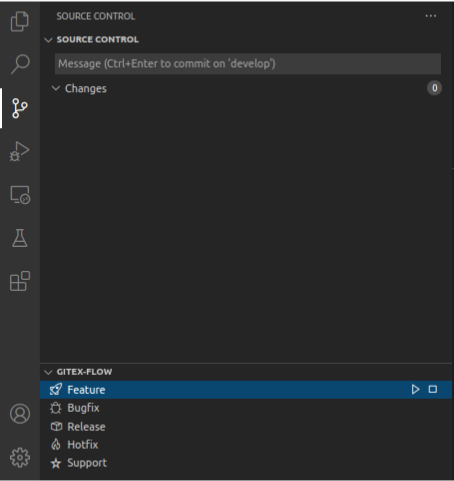

**gitex-vscode** is the official [gitex-flow](https://github.com/gitex-flow) extension for [visual studio code](https://code.visualstudio.com/).

## Usage

The use of **gitex-vscode** is very simple and intuitive. In the source control tab of visual studio code a new menu _GITEX-FLOW_ appears after the installation.
This menu lists the five git flow branch types, each offering two operations "start" (play button) and "finish" (stop button).
In addition, the menu provides an initialization option (plug) in the header to set up git flow in the current repository.
For all operations, you are guided through the standardized menu navigation of visual studio code.

  

## Configuration

_Configuration of gitex-vscode will follow soon_

## Acknowledgements

A special thanks to the developer of the visual studio extension [Gitflow Actions Sidebar](https://github.com/ardisaurus/vscode-gitflow) named [ardisaurus](https://github.com/ardisaurus). His project has provided the template of gitex-vscode in many points. But a fork of the project was not reasonable because of the big adaptations.
